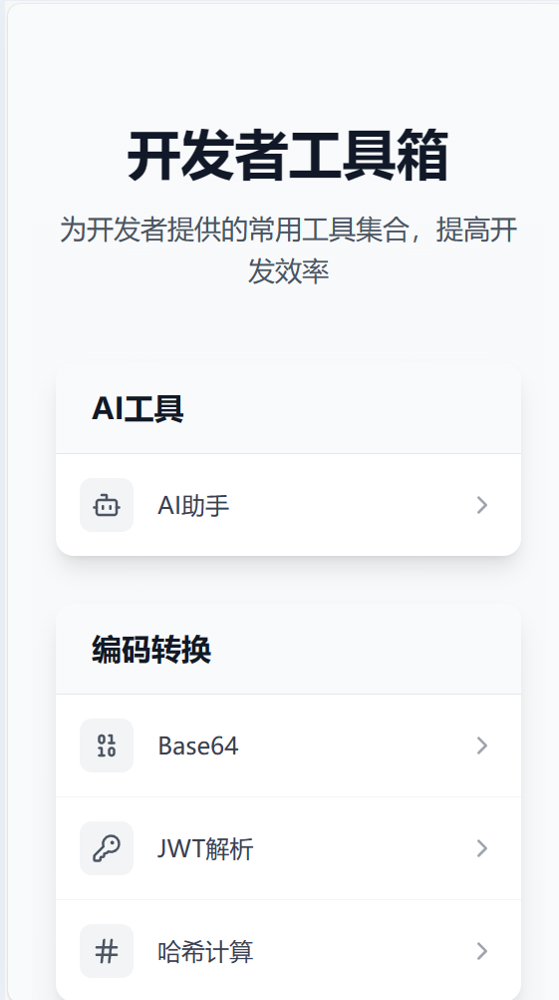

# DevTools 开发者工具箱

一个集成了常用开发工具的在线工具箱，包括GPT 智能对话、代码格式化、颜色选择器、二维码生成/解析等功能。

[在线体验](https://developer-tools-jet.vercel.app/)



## 🚀 功能特性

### AI 助手
- GPT 智能对话
- 问题分类与分析

### 编码工具
- Base64 编解码
- JWT Token 解析
- Hash 计算工具
- 正则表达式测试
- 代码格式化

### 样式工具
- 颜色选择器/调色板
- 排版工具
- 时间格式转换

### 实用工具
- 二维码生成/解析
- Emoji 选择器

## 🛠️ 技术栈

- React 18
- TypeScript
- React Router v6
- Tailwind CSS
- OpenAI API
- Monaco Editor
- Lucide Icons

## 📦 快速开始

### 安装依赖

```bash
pnpm install
```

### 配置环境变量
创建 `.env` 文件并添加：
```env
VITE_OPENAI_API_KEY=your_api_key_here
```

### 启动开发服务器
```bash
# 启动前端
pnpm run dev

# 启动后端
pnpm run dev:server
```

### 构建项目
```bash
pnpm run build
```

## 📝 开发说明

- 前端运行在 5173 端口
- 后端运行在 3001 端口
- 使用 Vite 作为构建工具
- 使用 TypeScript 进行类型检查
- 使用 Tailwind CSS 进行样式管理

## 📦 安装依赖

pnpm install

## 📦 运行

pnpm run dev
