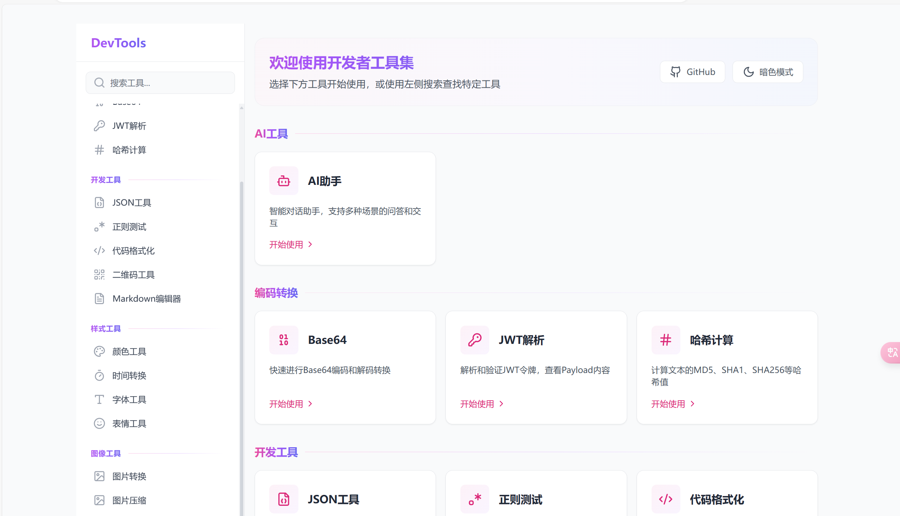

# DevTools 开发者工具箱

一个集成了常用开发工具的在线工具箱。

[在线体验](https://funenn.github.io/Developer-Tools)

## 🚀 功能特性

### 编码转换
- Base64 编解码
- JWT Token 解析
- Hash 计算工具

### 开发工具
- JSON 格式化/验证/压缩
- 正则表达式测试
- 代码格式化
- 二维码生成/解析

### 样式工具
- 颜色选择器/调色板
- 时间格式转换

### 图像工具
- 图片格式转换
- 图片压缩优化
- SVG 在线编辑

## 🛠️ 技术栈

- React 18
- TypeScript
- React Router v6
- Tailwind CSS
- Lucide Icons
- Monaco Editor

## 📦 安装依赖

pnpm install

## 📦 运行

pnpm run dev
